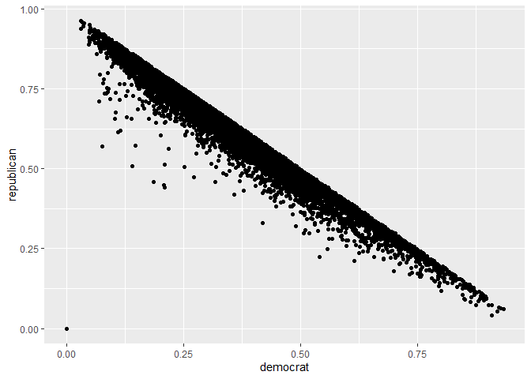
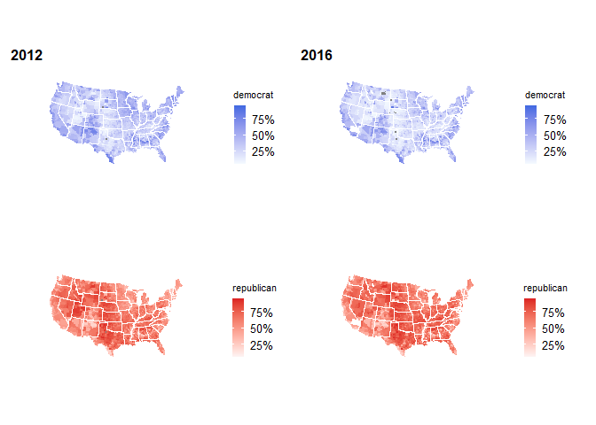
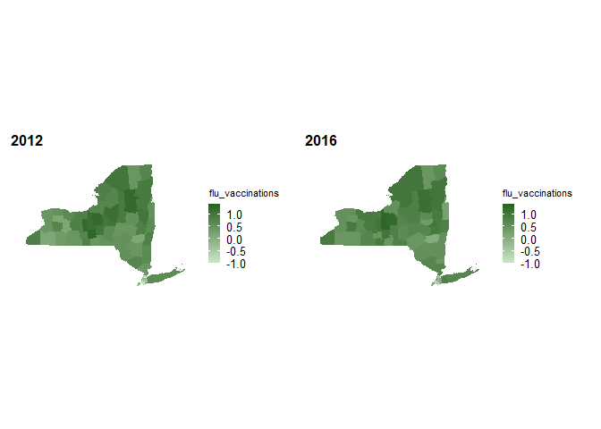

Connecting Political Views and Health Metrics
================
Riyadh Baksh (rhb2152), Anika Mitchell (am5088), Jeong Yun Yang (jy3306)
2024-12-07

## Motivation

The goal of this project is emulate an *ecological* study in order to
understand and visualize the relationship between political trends and
outcomes on county-level public health in the United States.
Specifically, we are interested in the potential correlations between a
variety of health metrics and presidential election results in both 2012
and 2016. By understanding the relationship between these data, this
project aims to understand sociopolitical and socioeconomic implications
for health and wellbeing at a county level, and offer insights into
patterns that may offer recommendations for broader application.

## Related Work

The inspiration for this project comes from a growing body of scientific
literature aimed at understanding how health transforms as the
sociopolitical climate shifts.

For example, Salas-Guerra’s 2021 multivariate correlational analysis of
four U.S states (California, New York, Texas, and Florida) investigated
political affiliation and viral contagion/mortality from COVID-19.
Findings indicated poverty and lack of insurance as a main risk factor
for the COVID contagion in Republican states (Salas-Guerra, 2021).

Other studies such as Bor’s 2017 study “*Diverging Life Expectancies and
Voting Patterns in the 2016 US Presidential Election*” examined voting
patterns and life expectancy at the county level. Main findings included
voting patterns undermining the overall health of the voter; that is, a
pattern was detected of residents who voted for Trump or didn’t vote at
all in 2016 and were most likely to be residents of counties that
experienced not only economic insecurity but decreased public health
indicated by higher mortality rates (Bor 2017).

Curtis et al.’s 2021 study “*Life expectancy and voting patterns in the
2020 U.S presidential election*” came to similar conclusions leveraging
county-level life expectancy data and voting data scraped from news
outlets. Specifically, they found that despite large shifts towards
Democratic candidates, communities that were most impacted by lower life
expectancy and lower health tended to vote Republican (Curtis et al.,
2021).

The results of these studies indicate a key point of interest related to
what communities choose to vote for compared to what those implications
on their health are. Our project aims to add to this body of data
analysis with a specific focus on health indicators like premature
death, preventable hospital stays, number of physicians geographically,
and flu vaccinations.

## Initial Questions

Our main research question is: how do national and county level
bipartisan voting patterns impact key health indicators (premature
death, preventable hospital stays, number of physicians, and vaccination
status) in 2012 and 2016. Our original research question was interested
in assessing this relationship from 2000-2020, however we chose to
constrain our data to using only 2012 and 2016 data after conducting
early data wrangling and exploratory analyses that identified this set
of time as having the most robust dataset available to appropriately
assess our relationship of interest. Additionally, this date range
(2012-2016) is of particular public health interest, as the decades long
trend of increased life expectancy between 1959 and 2016 started to
noticeably slow down after 2014 (Woolf and Schoomaker, 2019).

## Data

For information on health outcomes by county and by year, we used
information from this source:
<https://www.countyhealthrankings.org/health-data/methodology-and-sources/data-documentation>

For data on election results by county and by year, we consulted the MIT
election datasets: <https://electionlab.mit.edu/data>

We started by cleaning the `election` dataset, which contains
information such as county name, state, year, party, and total votes.
The mutate function was used to calculate the percentage of votes. The
common variable `year_county` was used to uniquely match the data for a
given year and county FIPS code.

We identified four measures that are the most robust in the datasets:
`Premature death`, `PReventable hospital stays`,
`Primary care physicians`, and `flu vaccinations`, and filtered for
these four measurements. Since these measurements have different units
and scales, we standardize each variable to improve visualization and
statistical analysis. This means that for each health metric, a value of
zero means the average, and each unit represents one standard deviation
away. For example, a `premature_death` value of 1 means that county has
a premature death rate that is one standard deviation higher than the
average county.

Here we join the `election` and `health` datasets by a common variable
`year_county`. Through our exploratory analysis, we found that years
2012 and 2016 had the least amount of missing data, hence we filter for
data for these years. Then we remove the outliers for each measurements.

## Exploratory Analysis

We first started by exploring each dataset individually. For the
`election` data, a plot was made comparing the county vote share for
`democrat` and for `republican`. It was observed that in many counties,
the sum of the `democrat` and `republican` percents do not add to 1,
which indicates the presence of third-parties. That being said, the
graph below shows there’s a limit where no points are above the line
$y=x$. This makes sense because the vote share in a specific county
cannot exceed 100%.

<!-- -->

Next, we considered how the four health variables under investigation
are related to each other. This was important to make sure they are all
independent from each other. In general, there is largely random
distribution of points, so there is no clear pattern. However, the
relationship between `premature_death` and `preventable_hospital_stays`
does suggest a positive correlation. Counties with higher premature
death rates also seem to have more preventable hospital stays, which
makes sense because a premature death means by definition that it was a
preventable death. There also seems to be a negative correlation between
`premature_death` and `flu_vaccinations`. With greater flu vaccinations,
we observe fewer premature deaths.

<!-- -->

Now, we began to look at the correlation between election results and
these four health metrics. For simplicity, the outcome or response
variable was chosen to be the `republican` vote share. However, as we
demonstrated above, this is negatively correlated with the `democrat`
vote share.

There does seem to be a lot of random scatter and a clear pattern is
hard to justify. However, some interesting observations are the positive
correlations between `physicians` and `republican` vote share. There
also seems to be a negative correlation between `flu_vaccinations` and
`republican` vote share.

<!-- -->

### Geographic Plots

We also decided to include maps as part of the exploratory analysis. The
plots below show the nationwide county-level vote share. The darker blue
represents higher `democrat` vote share. The darker red represents
higher `republican` vote share. As expected, these are inversely
related - that is, a darker blue area would also be lighter red. To
improve comparability, the scales are fixed so that the same shade of
blue, for example, means the same thing between the two years. We
noticed that when going from 2012 to 2016, the map became a lot lighter
blue, reflecting the decrease in the democrat popular vote from 2012 to
2016. Note: Alaska was removed due to a different way of assigning
counties, and thus Hawaii was also removed so that we only considered
the contiguous US.

<!-- -->

While the intention was to look at nationwide correlations, we realized
that there are many factors that influence voting across an entire
country. It is also more difficult to identify trends in large
heterogeneous populations. Therefore, we decided to also zoom in on New
York state. We also observed that from 2012 to 2016, the state became
lighter blue and darker red.

<!-- -->

Next, we considered the geographic distributions of the health metrics.
It would be difficult to see trends across the entire US, so instead, we
are only looking at New York state.

There does not seem to be a clear pattern for `premature_death`, as some
counties became lighter whereas others became darker.

<!-- -->

The `physicians` rate in each county appears to stay roughly constant
when going from 2012 to 2016.

<!-- -->

At first glance, it seems that there were fewer
`preventable_hospital_stays` in 2016 compared to 2012.

<!-- -->

Further, `flu_vaccinations` seems to have stayed roughly constant from
2012 to 2016.

<!-- -->

## Additional Analysis

Next, we conducted a series of multiple linear regressions to quantify
the effect of the health metrics on the `republican` vote share. There
were a total of six regressions: the US for both years, the US for 2012,
the US for 2016, NY state for both years, NY state for 2012, and NY
state for 2016. The estimates for the coefficients and the corresponding
R2 values are summarized in the tables below. Note that while not all
estimates were significant, most were at the 5% level. These numbers
will be further discussed in the next section.

| term                       | US_Overall | US_2012 | US_2016 | NY_Overall | NY_2012 | NY_2016 |
|:---------------------------|-----------:|--------:|--------:|-----------:|--------:|--------:|
| (Intercept)                |      0.624 |   0.600 |   0.641 |      0.520 |   0.431 |   0.548 |
| premature_death            |      0.025 |   0.016 |   0.024 |      0.113 |   0.051 |   0.109 |
| physicians                 |      0.079 |   0.064 |   0.090 |      0.079 |   0.067 |   0.106 |
| preventable_hospital_stays |      0.005 |   0.008 |   0.016 |     -0.027 |  -0.009 |   0.009 |
| flu_vaccinations           |     -0.015 |  -0.009 |  -0.022 |      0.088 |   0.078 |   0.102 |

Regression Coefficients on Percent Republican

| US_Overall | US_2012 | US_2016 | NY_Overall | NY_2012 | NY_2016 |
|-----------:|--------:|--------:|-----------:|--------:|--------:|
|      0.125 |   0.077 |   0.177 |      0.387 |   0.313 |   0.439 |

R2 Values

## Discussion

### National Trends from Election Results

From our preliminary analysis of the 2012–2016 election data, we
observed several key trends in the political landscape across U.S.
counties:

1.  Republican Dominance: More counties have the Republican Party as the
    majority party compared to those with a Democratic majority. As
    shown in Figure 1, Republican-leaning counties dominate the U.S.
    geography, particularly in the Midwest and South. This trend is
    consistent with historical voting patterns, where these regions have
    traditionally favored the Republican Party.

2.  Strong Republican Support: In addition to a larger number of
    Republican-majority counties, there is a higher concentration of
    counties with strong Republican support compared to Democratic
    counties, which tend to be more evenly split or less firmly aligned
    with the Democratic Party.

3.  Shift Toward Republicanism: Comparing the 2012 and 2016 data, we
    observed that the proportion of Democratic-leaning counties
    decreased. This suggests a general shift towards the Republican
    Party across more counties over the four-year period.

There are regional factors that may explain these trends. The Midwest
and South have long been strongholds for the Republican Party. Changes
in economic conditions, cultural shifts, or issues like immigration and
healthcare may have further entrenched this political divide. Areas that
experienced economic hardship, such as the decline of manufacturing in
certain regions, might have shifted politically towards the Republican
Party due to its promises of job creation and protectionism.
Furthermore, there could be a broader realignment of voters based on
issues like race, education, and income, which have become more
pronounced in recent elections. These trends align with findings from
other studies that suggest a growing rural-urban divide, where rural
areas have increasingly supported Republicans, while urban areas have
leaned Democratic.

### Health Metrics and Election Results

We examined several key health metrics at the county level to explore
whether they correlate with political views. The health metrics analyzed
include the number of physicians, premature death rates, preventable
hospital stays, and flu vaccination rates. Initial analysis revealed no
definitive relationship between the health metrics (physicians,
premature death, preventable hospital stays, and flu vaccinations) and
the political outcomes across all counties. This suggests that these
health metrics alone do not directly predict political behavior at the
county level. A plot comparing premature death and preventable hospital
stays showed a positive relationship, meaning that counties with higher
rates of premature death also tended to have higher rates of preventable
hospital stays (Figure 2). This could indicate that areas with poor
health outcomes face systemic issues related to healthcare access or
quality. When examining health metrics by political party, we found that
counties with more physicians tended to lean Republican (Figure 3). This
may seem counterintuitive at first, but it could be explained by the
fact that counties with more physicians might also have wealthier or
more urban populations, which tend to lean Republican. Similarly,
counties with higher rates of premature death also tended to have a
stronger Republican vote share. This might be linked to regions facing
economic hardship or healthcare challenges, which often vote Republican
in search of policies to address these issues. Regression Analysis To
better understand the relationships between health metrics and political
preferences, we conducted a regression analysis using covariates such as
premature death, number of physicians, preventable hospital stays, and
flu vaccinations to predict the percentage of Republican votes in each
county (Table 1).

- Premature Death: For every 1 standard deviation increase in premature
  deaths, the Republican vote share increased by 0.025% (p \< 0.005).
  Counties with higher premature death rates might face higher levels of
  economic distress, which could drive voters to support the Republican
  Party in hopes of economic recovery and healthcare reforms.

- Number of Physicians: For every 1 standard deviation increase in the
  number of physicians, the Republican vote share increased by 0.078% (p
  \< 0.005). Wealthier, more urban counties with better healthcare
  access (i.e., more physicians) may lean Republican due to broader
  political and socioeconomic factors in these areas.

- Flu Vaccinations: Interestingly, for every 1 standard deviation
  increase in flu vaccinations, the Republican vote share decreased by
  0.016% (p \< 0.005). The negative correlation between flu vaccinations
  and Republican vote share may reflect demographic differences, where
  counties with higher vaccination rates could be more urban and
  liberal-leaning, or it could reflect regional differences in attitudes
  towards healthcare policies.

To assess the overall strength of the correlation, we calculated the
regression coefficients for the percentage of Republican votes in
counties. The overall U.S. dataset had an R-squared value of 0.125,
indicating significant variation in the data (Table 2). This suggests
that while health metrics have some impact, they do not fully explain
the variation in voting behavior. When we stratified the data by
election years (2012 and 2016), we found that the variations remained
large, suggesting that the relationship between health metrics and
political views is not constant over time. Focusing specifically on New
York counties, we observed a higher R-squared value of 0.387. This
indicates that there is less variation in the data for New York counties
compared to the overall U.S. dataset. This was expected, as New York has
a more homogenous population with fewer extreme rural-urban divides than
the national data, leading to a stronger correlation between health
outcomes and voting behavior.
