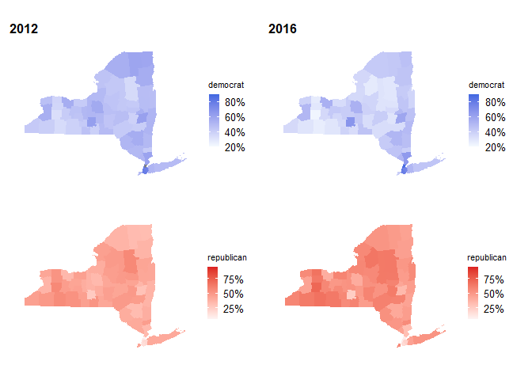
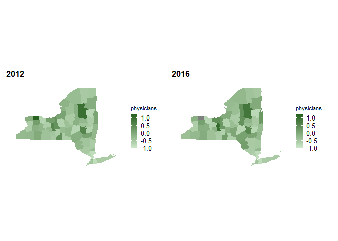
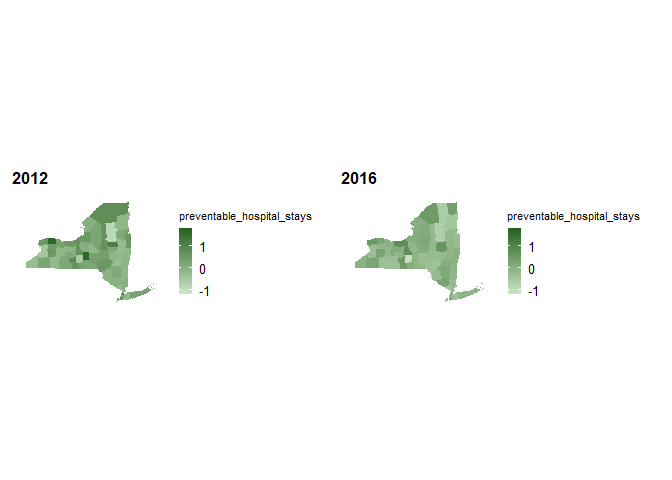
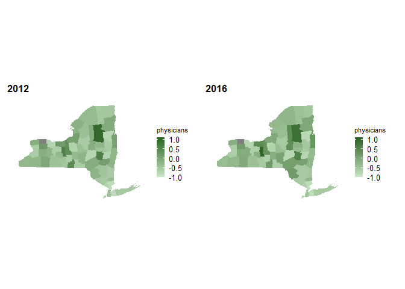
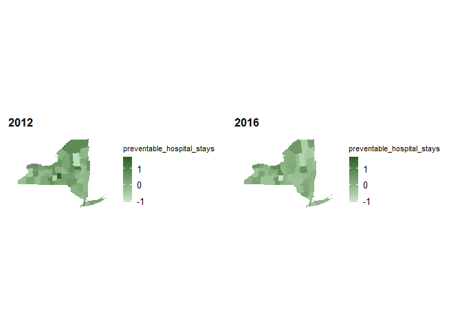
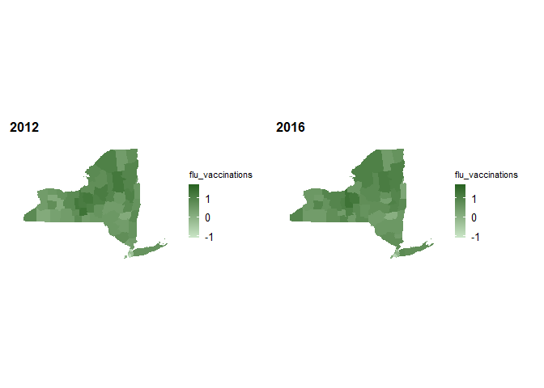

Connecting Political Views and Health Metrics
================
Riyadh Baksh (rhb2152), Anika Mitchell (am5088), Jeong Yun Yang (jy3306)
2024-12-06

We are ONLY looking at 2012 and 2016 as these have the most complete
data.

## Loading and Cleaning Datasets

``` r
library(tidyverse)
```

Cleaning the `election` dataset, which contains information such as
county name, state, year, party, and total votes. Using the mutate
function to calculate the percentage of votes. Identifying the common
variable of `county_fips`that is present in both the `election` and
`health` datasets.

``` r
election =
  read_csv("data/election.csv") |>
  filter(party=="DEMOCRAT" | party=="REPUBLICAN") |>
  group_by(county_fips,county_name,state_po,year,party,totalvotes) |>
  summarize(
    votes = sum(candidatevotes)
  ) |>
  mutate(
    percent = votes/totalvotes,
    county_fips = sprintf("%05d",county_fips),
    year_county = paste(year,county_fips,sep="-")
  ) |>
  select(-totalvotes,-votes) |>
  pivot_wider(
    names_from = "party",
    values_from = "percent"
  ) |>
  janitor::clean_names()
```

Identified four measures that are the most robust in the datasets:
`Premature death`, `PReventable hospital stays`,
`Primary care physicians`, and `flu vaccinations`. Filtering for these
four measurements. Since these measurements have different units. Here
we try to standardize for data visualization by converting the
measurements into standard deviations.

``` r
health =
  read_csv("data/health.csv") |>
  mutate(
    year = substr(yearspan,start=1,stop=4),
    county_fips = paste(statecode,countycode,sep=""),
    year_county = paste(year,county_fips,sep="-")
  ) |>
  filter(
    measurename == "Premature death" |
    measurename == "Preventable hospital stays" |
    measurename == "Primary care physicians" |
    measurename == "Flu vaccinations"
  ) |>
  select(year_county,year,county_fips,county,state,measurename,rawvalue) |>
  pivot_wider(
    names_from = "measurename",
    values_from = "rawvalue"
  ) |>
  janitor::clean_names() |>
  mutate(
    premature_death = scale(premature_death),
    primary_care_physicians = scale(primary_care_physicians),
    preventable_hospital_stays = scale(preventable_hospital_stays),
    flu_vaccinations = scale(flu_vaccinations)
  )
```

## Exploratory Analysis

This plot looks at the overall party make-up of the counties in the
dataset.

``` r
election |>
  drop_na() |>
  ggplot(aes(x=democrat,y=republican)) + geom_point()
```

<!-- -->

Here we join the `election` and `health` datasets by a common variable
`county_fips`. Through our exploratory analysis, we found that years
2012 - 2016 had the least amount of missing data, hence we filter for
data between these years. Then we remove the outliers for each
measurements.

``` r
health_election =
  left_join(election,health,by="year_county") |>
  rename(
    county_fips=county_fips.x,
    year=year.x) |>
  select(county_fips,county_name,state_po,year,democrat,republican,
         premature_death,
         physicians=primary_care_physicians,
         preventable_hospital_stays,
         flu_vaccinations) |>
  filter(year==2012 | year==2016)

health_election_with_na = health_election

health_election = drop_na(health_election)

# remove outliers in premature death
quartiles = quantile(health_election$premature_death, probs=c(.25,.75))
IQR = IQR(health_election$premature_death)

lower = quartiles[1] - 1.5*IQR
upper = quartiles[2] + 1.5*IQR

health_election =
  health_election |>
  filter(
    premature_death > lower &
    premature_death < upper
  )
```

    ## Warning: Using one column matrices in `filter()` was deprecated in dplyr 1.1.0.
    ## ℹ Please use one dimensional logical vectors instead.
    ## This warning is displayed once every 8 hours.
    ## Call `lifecycle::last_lifecycle_warnings()` to see where this warning was
    ## generated.

``` r
# remove outliers in primary care physicians
quartiles = quantile(health_election$physicians, probs=c(.25,.75))
IQR = IQR(health_election$physicians)

lower = quartiles[1] - 1.5*IQR
upper = quartiles[2] + 1.5*IQR

health_election =
  health_election |>
  filter(
    physicians > lower &
    physicians < upper
  )

# remove outliers in preventable hospital stays
quartiles = quantile(health_election$preventable_hospital_stays, probs=c(.25,.75))
IQR = IQR(health_election$preventable_hospital_stays)

lower = quartiles[1] - 1.5*IQR
upper = quartiles[2] + 1.5*IQR

health_election =
  health_election |>
  filter(
    preventable_hospital_stays > lower &
    preventable_hospital_stays < upper
  )

# remove outliers in flu vaccinations
quartiles = quantile(health_election$flu_vaccinations, probs=c(.25,.75))
IQR = IQR(health_election$flu_vaccinations)

lower = quartiles[1] - 1.5*IQR
upper = quartiles[2] + 1.5*IQR

health_election =
  health_election |>
  filter(
    flu_vaccinations > lower &
    flu_vaccinations < upper
  )
```

``` r
library(patchwork)

p1 =
  health_election |>
  ggplot(aes(x=premature_death,y=physicians)) +
  geom_point(size=0.5)

p2 =
  health_election |>
  ggplot(aes(x=premature_death,y=preventable_hospital_stays)) +
  geom_point(size=0.5)

p3 =
  health_election |>
  ggplot(aes(x=premature_death,y=flu_vaccinations)) +
  geom_point(size=0.5)

p4 =
  health_election |>
  ggplot(aes(x=physicians,y=preventable_hospital_stays)) +
  geom_point(size=0.5)

p5 =
  health_election |>
  ggplot(aes(x=physicians,y=flu_vaccinations)) +
  geom_point(size=0.5)

p6 =
  health_election |>
  ggplot(aes(x=preventable_hospital_stays,y=flu_vaccinations)) +
  geom_point(size=0.5)

(p1 + p2 + p3) / (p4 + p5 + p6)
```

<!-- -->

``` r
a1 =
  health_election |>
  ggplot(aes(x=premature_death,y=republican)) + geom_point(size=0.5)

a2 =
  health_election |>
  ggplot(aes(x=physicians,y=republican)) + geom_point(size=0.5)

a3 =
  health_election |>
  ggplot(aes(x=preventable_hospital_stays,y=republican)) + geom_point(size=0.5)

a4 =
  health_election |>
  ggplot(aes(x=flu_vaccinations,y=republican)) + geom_point(size=0.5)

(a1 + a2)/(a3 + a4)
```

<!-- -->

``` r
overall = lm(republican ~ premature_death + physicians + preventable_hospital_stays + flu_vaccinations, data = health_election)
overall_2012 = lm(republican ~ premature_death + physicians + preventable_hospital_stays + flu_vaccinations, data = filter(health_election,year==2012))
overall_2016 = lm(republican ~ premature_death + physicians + preventable_hospital_stays + flu_vaccinations, data = filter(health_election,year==2016))
NY = lm(republican ~ premature_death + physicians + preventable_hospital_stays + flu_vaccinations, data = filter(health_election,state_po=="NY"))
NY_2012 = lm(republican ~ premature_death + physicians + preventable_hospital_stays + flu_vaccinations, data = filter(health_election,state_po=="NY",year==2012))
NY_2016 = lm(republican ~ premature_death + physicians + preventable_hospital_stays + flu_vaccinations, data = filter(health_election,state_po=="NY",year==2016))
reg = tibble(
term=broom::tidy(overall)$term,
US_Overall=overall$coefficients,
US_2012=overall_2012$coefficients,
US_2016=overall_2016$coefficients,
NY_Overall=NY$coefficients,
NY_2012=NY_2012$coefficients,
NY_2016=NY_2016$coefficients
)
knitr::kable(reg, digits=3,caption="Regression Coefficients on Percent Republican")
```

| term                       | US_Overall | US_2012 | US_2016 | NY_Overall | NY_2012 | NY_2016 |
|:---------------------------|-----------:|--------:|--------:|-----------:|--------:|--------:|
| (Intercept)                |      0.624 |   0.600 |   0.641 |      0.520 |   0.431 |   0.548 |
| premature_death            |      0.025 |   0.016 |   0.024 |      0.113 |   0.051 |   0.109 |
| physicians                 |      0.079 |   0.064 |   0.090 |      0.079 |   0.067 |   0.106 |
| preventable_hospital_stays |      0.005 |   0.008 |   0.016 |     -0.027 |  -0.009 |   0.009 |
| flu_vaccinations           |     -0.015 |  -0.009 |  -0.022 |      0.088 |   0.078 |   0.102 |

Regression Coefficients on Percent Republican

``` r
r2 = tibble(
US_Overall=broom::glance(overall)$r.squared,
US_2012=broom::glance(overall_2012)$r.squared,
US_2016=broom::glance(overall_2016)$r.squared,
NY_Overall=broom::glance(NY)$r.squared,
NY_2012=broom::glance(NY_2012)$r.squared,
NY_2016=broom::glance(NY_2016)$r.squared
)
knitr::kable(r2, digits=3,caption="R2 Values")
```

| US_Overall | US_2012 | US_2016 | NY_Overall | NY_2012 | NY_2016 |
|-----------:|--------:|--------:|-----------:|--------:|--------:|
|      0.125 |   0.077 |   0.177 |      0.387 |   0.313 |   0.439 |

R2 Values

## Geographic Plots

``` r
#devtools::install_github("UrbanInstitute/urbnmapr")
#remotes::install_github("UrbanInstitute/urbnthemes",build_vignettes = TRUE)

library(urbnmapr)
library(urbnthemes)
```

``` r
library(urbnmapr)

# Plots for 2012
county_data =
  health_election_with_na |>
  filter(year==2012) |>
  right_join(counties,by="county_fips") |>
  filter(state_name!="Alaska" & state_name!="Hawaii")

dem_2012 =
county_data |>
  ggplot(aes(long, lat, group = group, fill = democrat)) +
  ggtitle("2012") +
  geom_polygon(color = NA) +
  scale_fill_gradient(labels = scales::percent,
                      guide = "colourbar",
                      low="#f5fbff",
                      high="#4169e1",
                      limits=c(0.05,0.95)) +
  geom_polygon(data = states, mapping = aes(long, lat, group = group),
               fill = NA, color = "#ffffff") +
  coord_map(projection = "albers", lat0 = 39, lat1 = 45) +
  theme(legend.title = element_text(),
        legend.key.width = unit(.5, "in")) +
  labs(fill = "democrat") +
  theme_urbn_map()

rep_2012 =
county_data |>
  ggplot(aes(long, lat, group = group, fill = republican)) +
  geom_polygon(color = NA) +
  scale_fill_gradient(labels = scales::percent,
                      guide = "colourbar",
                      low="#fdf5f5",
                      high="#dc2323",
                      limits=c(0.05,0.95)) +
  geom_polygon(data = states, mapping = aes(long, lat, group = group),
               fill = NA, color = "#ffffff") +
  coord_map(projection = "albers", lat0 = 39, lat1 = 45) +
  theme(legend.title = element_text(),
        legend.key.width = unit(.5, "in")) +
  labs(fill = "republican") +
  theme_urbn_map()

# Plots for 2016
county_data =
  health_election_with_na |>
  filter(year==2016) |>
  right_join(counties,by="county_fips") |>
  filter(state_name!="Alaska" & state_name!="Hawaii")
```

    ## Warning in right_join(filter(health_election_with_na, year == 2016), counties, : Detected an unexpected many-to-many relationship between `x` and `y`.
    ## ℹ Row 1 of `x` matches multiple rows in `y`.
    ## ℹ Row 4082 of `y` matches multiple rows in `x`.
    ## ℹ If a many-to-many relationship is expected, set `relationship =
    ##   "many-to-many"` to silence this warning.

``` r
dem_2016 =
county_data |>
  ggplot(aes(long, lat, group = group, fill = democrat)) +
  ggtitle("2016") +
  geom_polygon(color = NA) +
  scale_fill_gradient(labels = scales::percent,
                      guide = "colourbar",
                      low="#f5fbff",
                      high="#4169e1",
                      limits=c(0.05,0.95)) +
  geom_polygon(data = states, mapping = aes(long, lat, group = group),
               fill = NA, color = "#ffffff") +
  coord_map(projection = "albers", lat0 = 39, lat1 = 45) +
  theme(legend.title = element_text(),
        legend.key.width = unit(.5, "in")) +
  labs(fill = "democrat") +
  theme_urbn_map()

rep_2016 =
county_data |>
  ggplot(aes(long, lat, group = group, fill = republican)) +
  geom_polygon(color = NA) +
  scale_fill_gradient(labels = scales::percent,
                      guide = "colourbar",
                      low="#fdf5f5",
                      high="#dc2323",
                      limits=c(0.05,0.95)) +
  geom_polygon(data = states, mapping = aes(long, lat, group = group),
               fill = NA, color = "#ffffff") +
  coord_map(projection = "albers", lat0 = 39, lat1 = 45) +
  theme(legend.title = element_text(),
        legend.key.width = unit(.5, "in")) +
  labs(fill = "republican") +
  theme_urbn_map()

(dem_2012+dem_2016)/(rep_2012+rep_2016)
```

<!-- -->

``` r
# Plots for 2012

county_data =
  health_election_with_na |>
  filter(year==2012) |>
  right_join(counties,by="county_fips") |>
  filter(state_po=="NY")

dem_2012 =
county_data |>
  ggplot(aes(long, lat, group = group, fill = democrat)) +
  ggtitle("2012") +
  geom_polygon(color = NA) +
  scale_fill_gradient(labels = scales::percent,
                      guide = "colourbar",
                      low="#f5fbff",
                      high="#4169e1",
                      limits=c(0.2,0.9)) +
  coord_map(projection = "albers", lat0 = 39, lat1 = 45) +
  theme(legend.title = element_text(),
        legend.key.width = unit(.5, "in")) +
  labs(fill = "democrat") +
  theme_urbn_map()

rep_2012 =
county_data |>
  ggplot(aes(long, lat, group = group, fill = republican)) +
  geom_polygon(color = NA) +
  scale_fill_gradient(labels = scales::percent,
                      guide = "colourbar",
                      low="#fdf5f5",
                      high="#dc2323",
                      limits=c(0.05,0.95)) +
  coord_map(projection = "albers", lat0 = 39, lat1 = 45) +
  theme(legend.title = element_text(),
        legend.key.width = unit(.5, "in")) +
  labs(fill = "republican") +
  theme_urbn_map()

# Plots for 2016
county_data =
  health_election_with_na |>
  filter(year==2016) |>
  right_join(counties,by="county_fips") |>
  filter(state_po=="NY")

dem_2016 =
county_data |>
  ggplot(aes(long, lat, group = group, fill = democrat)) +
  ggtitle("2016") +
  geom_polygon(color = NA) +
  scale_fill_gradient(labels = scales::percent,
                      guide = "colourbar",
                      low="#f5fbff",
                      high="#4169e1",
                      limits=c(0.2,0.9)) +
  coord_map(projection = "albers", lat0 = 39, lat1 = 45) +
  theme(legend.title = element_text(),
        legend.key.width = unit(.5, "in")) +
  labs(fill = "democrat") +
  theme_urbn_map()

rep_2016 =
county_data |>
  ggplot(aes(long, lat, group = group, fill = republican)) +
  geom_polygon(color = NA) +
  scale_fill_gradient(labels = scales::percent,
                      guide = "colourbar",
                      low="#fdf5f5",
                      high="#dc2323",
                      limits=c(0.05,0.95)) +
  coord_map(projection = "albers", lat0 = 39, lat1 = 45) +
  theme(legend.title = element_text(),
        legend.key.width = unit(.5, "in")) +
  labs(fill = "republican") +
  theme_urbn_map()

(dem_2012+dem_2016)/(rep_2012+rep_2016)
```

<!-- -->

``` r
# Plots for 2012
county_data =
health_election_with_na |>
filter(year==2012) |>
right_join(counties,by="county_fips") |>
filter(state_po=="NY")
dem_2012 =
county_data |>
ggplot(aes(long, lat, group = group, fill = democrat)) +
ggtitle("2012") +
geom_polygon(color = NA) +
scale_fill_gradient(labels = scales::percent,
guide = "colourbar",
low="#f5fbff",
high="#4169e1",
limits=c(0.2,0.9)) +
coord_map(projection = "albers", lat0 = 39, lat1 = 45) +
theme(legend.title = element_text(),
legend.key.width = unit(.5, "in")) +
labs(fill = "democrat") +
theme_urbn_map()
rep_2012 =
county_data |>
ggplot(aes(long, lat, group = group, fill = republican)) +
geom_polygon(color = NA) +
scale_fill_gradient(labels = scales::percent,
guide = "colourbar",
low="#fdf5f5",
high="#dc2323",
limits=c(0.05,0.95)) +
coord_map(projection = "albers", lat0 = 39, lat1 = 45) +
theme(legend.title = element_text(),
legend.key.width = unit(.5, "in")) +
labs(fill = "republican") +
theme_urbn_map()
# Plots for 2016
county_data =
health_election_with_na |>
filter(year==2016) |>
right_join(counties,by="county_fips") |>
filter(state_po=="NY")
```

    ## Warning in right_join(filter(health_election_with_na, year == 2016), counties, : Detected an unexpected many-to-many relationship between `x` and `y`.
    ## ℹ Row 1 of `x` matches multiple rows in `y`.
    ## ℹ Row 4082 of `y` matches multiple rows in `x`.
    ## ℹ If a many-to-many relationship is expected, set `relationship =
    ##   "many-to-many"` to silence this warning.

``` r
dem_2016 =
county_data |>
ggplot(aes(long, lat, group = group, fill = democrat)) +
ggtitle("2016") +
geom_polygon(color = NA) +
scale_fill_gradient(labels = scales::percent,
guide = "colourbar",
low="#f5fbff",
high="#4169e1",
limits=c(0.2,0.9)) +
coord_map(projection = "albers", lat0 = 39, lat1 = 45) +
theme(legend.title = element_text(),
legend.key.width = unit(.5, "in")) +
labs(fill = "democrat") +
theme_urbn_map()
rep_2016 =
county_data |>
ggplot(aes(long, lat, group = group, fill = republican)) +
geom_polygon(color = NA) +
scale_fill_gradient(labels = scales::percent,
guide = "colourbar",
low="#fdf5f5",
high="#dc2323",
limits=c(0.05,0.95)) +
coord_map(projection = "albers", lat0 = 39, lat1 = 45) +
theme(legend.title = element_text(),
legend.key.width = unit(.5, "in")) +
labs(fill = "republican") +
theme_urbn_map()
(dem_2012+dem_2016)/(rep_2012+rep_2016)
```

<!-- -->

``` r
# PREMATURE DEATH
# Plots for 2012
county_data =
health_election_with_na |>
filter(year==2012) |>
right_join(counties,by="county_fips") |>
filter(state_po=="NY")
plot_2012 =
county_data |>
ggplot(aes(long, lat, group = group, fill = premature_death)) +
ggtitle("2012") +
geom_polygon(color = NA) +
scale_fill_gradient(guide = "colourbar",
low="#cce7c9",
high="#276221",
limits=c(-2,0.5)) +
coord_map(projection = "albers", lat0 = 39, lat1 = 45) +
theme(legend.title = element_text(),
legend.key.width = unit(.5, "in")) +
labs(fill = "premature_death") +
theme_urbn_map()
# Plots for 2016
county_data =
health_election_with_na |>
filter(year==2016) |>
right_join(counties,by="county_fips") |>
filter(state_po=="NY")
```

    ## Warning in right_join(filter(health_election_with_na, year == 2016), counties, : Detected an unexpected many-to-many relationship between `x` and `y`.
    ## ℹ Row 1 of `x` matches multiple rows in `y`.
    ## ℹ Row 4082 of `y` matches multiple rows in `x`.
    ## ℹ If a many-to-many relationship is expected, set `relationship =
    ##   "many-to-many"` to silence this warning.

``` r
plot_2016 =
county_data |>
ggplot(aes(long, lat, group = group, fill = premature_death)) +
ggtitle("2016") +
geom_polygon(color = NA) +
scale_fill_gradient(
guide = "colourbar",
low="#cce7c9",
high="#276221",
limits=c(-2,0.5)) +
coord_map(projection = "albers", lat0 = 39, lat1 = 45) +
theme(legend.title = element_text(),
legend.key.width = unit(.5, "in")) +
labs(fill = "premature_death") +
theme_urbn_map()
plot_2012 + plot_2016
```

<!-- -->

``` r
# PHYSICIANS
# Plots for 2012
county_data =
health_election_with_na |>
filter(year==2012) |>
right_join(counties,by="county_fips") |>
filter(state_po=="NY")
plot_2012 =
county_data |>
ggplot(aes(long, lat, group = group, fill = physicians)) +
ggtitle("2012") +
geom_polygon(color = NA) +
scale_fill_gradient(guide = "colourbar",
low="#cce7c9",
high="#276221",
limits=c(-1,1.1)) +
coord_map(projection = "albers", lat0 = 39, lat1 = 45) +
theme(legend.title = element_text(),
legend.key.width = unit(.5, "in")) +
labs(fill = "physicians") +
theme_urbn_map()
# Plots for 2016
county_data =
health_election_with_na |>
filter(year==2016) |>
right_join(counties,by="county_fips") |>
filter(state_po=="NY")
```

    ## Warning in right_join(filter(health_election_with_na, year == 2016), counties, : Detected an unexpected many-to-many relationship between `x` and `y`.
    ## ℹ Row 1 of `x` matches multiple rows in `y`.
    ## ℹ Row 4082 of `y` matches multiple rows in `x`.
    ## ℹ If a many-to-many relationship is expected, set `relationship =
    ##   "many-to-many"` to silence this warning.

``` r
plot_2016 =
county_data |>
ggplot(aes(long, lat, group = group, fill = physicians)) +
ggtitle("2016") +
geom_polygon(color = NA) +
scale_fill_gradient(
guide = "colourbar",
low="#cce7c9",
high="#276221",
limits=c(-1,1.1)) +
coord_map(projection = "albers", lat0 = 39, lat1 = 45) +
theme(legend.title = element_text(),
legend.key.width = unit(.5, "in")) +
labs(fill = "physicians") +
theme_urbn_map()
plot_2012 + plot_2016
```

<!-- -->

``` r
# Preventable Hospital
# Plots for 2012
county_data =
health_election_with_na |>
filter(year==2012) |>
right_join(counties,by="county_fips") |>
filter(state_po=="NY")
plot_2012 =
county_data |>
ggplot(aes(long, lat, group = group, fill = preventable_hospital_stays)) +
ggtitle("2012") +
geom_polygon(color = NA) +
scale_fill_gradient(guide = "colourbar",
low="#cce7c9",
high="#276221",
limits=c(-1.1,1.7)) +
coord_map(projection = "albers", lat0 = 39, lat1 = 45) +
theme(legend.title = element_text(),
legend.key.width = unit(.5, "in")) +
labs(fill = "preventable_hospital_stays") +
theme_urbn_map()
# Plots for 2016
county_data =
health_election_with_na |>
filter(year==2016) |>
right_join(counties,by="county_fips") |>
filter(state_po=="NY")
```

    ## Warning in right_join(filter(health_election_with_na, year == 2016), counties, : Detected an unexpected many-to-many relationship between `x` and `y`.
    ## ℹ Row 1 of `x` matches multiple rows in `y`.
    ## ℹ Row 4082 of `y` matches multiple rows in `x`.
    ## ℹ If a many-to-many relationship is expected, set `relationship =
    ##   "many-to-many"` to silence this warning.

``` r
plot_2016 =
county_data |>
ggplot(aes(long, lat, group = group, fill = preventable_hospital_stays)) +
ggtitle("2016") +
geom_polygon(color = NA) +
scale_fill_gradient(
guide = "colourbar",
low="#cce7c9",
high="#276221",
limits=c(-1.1,1.7)) +
coord_map(projection = "albers", lat0 = 39, lat1 = 45) +
theme(legend.title = element_text(),
legend.key.width = unit(.5, "in")) +
labs(fill = "preventable_hospital_stays") +
theme_urbn_map()
plot_2012 + plot_2016
```

<!-- -->

``` r
# FLU VACCINATIONS
# Plots for 2012
county_data =
health_election_with_na |>
filter(year==2012) |>
right_join(counties,by="county_fips") |>
filter(state_po=="NY")
plot_2012 =
county_data |>
ggplot(aes(long, lat, group = group, fill = flu_vaccinations)) +
ggtitle("2012") +
geom_polygon(color = NA) +
scale_fill_gradient(guide = "colourbar",
low="#cce7c9",
high="#276221",
limits=c(-1.1,1.7)) +
coord_map(projection = "albers", lat0 = 39, lat1 = 45) +
theme(legend.title = element_text(),
legend.key.width = unit(.5, "in")) +
labs(fill = "flu_vaccinations") +
theme_urbn_map()
# Plots for 2016
county_data =
health_election_with_na |>
filter(year==2016) |>
right_join(counties,by="county_fips") |>
filter(state_po=="NY")
```

    ## Warning in right_join(filter(health_election_with_na, year == 2016), counties, : Detected an unexpected many-to-many relationship between `x` and `y`.
    ## ℹ Row 1 of `x` matches multiple rows in `y`.
    ## ℹ Row 4082 of `y` matches multiple rows in `x`.
    ## ℹ If a many-to-many relationship is expected, set `relationship =
    ##   "many-to-many"` to silence this warning.

``` r
plot_2016 =
county_data |>
ggplot(aes(long, lat, group = group, fill = flu_vaccinations)) +
ggtitle("2016") +
geom_polygon(color = NA) +
scale_fill_gradient(
guide = "colourbar",
low="#cce7c9",
high="#276221",
limits=c(-1.1,1.7)) +
coord_map(projection = "albers", lat0 = 39, lat1 = 45) +
theme(legend.title = element_text(),
legend.key.width = unit(.5, "in")) +
labs(fill = "flu_vaccinations") +
theme_urbn_map()
plot_2012 + plot_2016
```

<!-- -->
