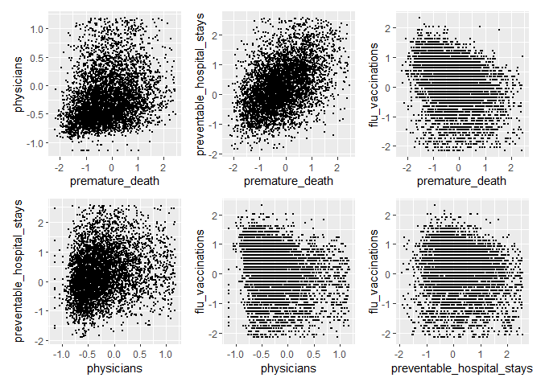

Connecting Political Views and Health Metrics
================
Riyadh Baksh (rhb2152), Anika Mitchell (am5088), Jeong Yun Yang (jy3306)
2024-12-03

## Loading and Cleaning Datasets

``` r
library(tidyverse)
```

``` r
election =
  read_csv("data/election.csv") |>
  filter(party=="DEMOCRAT" | party=="REPUBLICAN") |>
  group_by(county_fips,county_name,state_po,year,party,totalvotes) |>
  summarize(
    votes = sum(candidatevotes)
  ) |>
  mutate(
    percent = votes/totalvotes,
    county_fips = sprintf("%05d",county_fips),
    year_county = paste(year,county_fips,sep="-")
  ) |>
  select(-totalvotes,-votes) |>
  pivot_wider(
    names_from = "party",
    values_from = "percent"
  ) |>
  janitor::clean_names()
```

``` r
health =
  read_csv("data/health.csv") |>
  mutate(
    year = substr(yearspan,start=1,stop=4),
    county_fips = paste(statecode,countycode,sep=""),
    year_county = paste(year,county_fips,sep="-")
  ) |>
  filter(
    measurename == "Premature death" |
    measurename == "Preventable hospital stays" |
    measurename == "Primary care physicians" |
    measurename == "Flu vaccinations"
  ) |>
  select(year_county,year,county_fips,county,state,measurename,rawvalue) |>
  pivot_wider(
    names_from = "measurename",
    values_from = "rawvalue"
  ) |>
  janitor::clean_names() |>
  mutate(
    premature_death = scale(premature_death),
    primary_care_physicians = scale(primary_care_physicians),
    preventable_hospital_stays = scale(preventable_hospital_stays),
    flu_vaccinations = scale(flu_vaccinations)
  )
```

## Exploratory Analysis

``` r
election |>
  drop_na() |>
  ggplot(aes(x=democrat,y=republican)) + geom_point()
```

<!-- -->

``` r
health_election =
  left_join(election,health,by="year_county") |>
  rename(
    county_fips=county_fips.x,
    year=year.x) |>
  select(county_fips,county_name,state_po,year,democrat,republican,
         premature_death,
         physicians=primary_care_physicians,
         preventable_hospital_stays,
         flu_vaccinations) |>
  drop_na()

# remove outliers in premature death
quartiles = quantile(health_election$premature_death, probs=c(.25,.75))
IQR = IQR(health_election$premature_death)

lower = quartiles[1] - 1.5*IQR
upper = quartiles[2] + 1.5*IQR

health_election =
  health_election |>
  filter(
    premature_death > lower &
    premature_death < upper
  )
```

    ## Warning: Using one column matrices in `filter()` was deprecated in dplyr 1.1.0.
    ## ℹ Please use one dimensional logical vectors instead.
    ## This warning is displayed once every 8 hours.
    ## Call `lifecycle::last_lifecycle_warnings()` to see where this warning was
    ## generated.

``` r
# remove outliers in primary care physicians
quartiles = quantile(health_election$physicians, probs=c(.25,.75))
IQR = IQR(health_election$physicians)

lower = quartiles[1] - 1.5*IQR
upper = quartiles[2] + 1.5*IQR

health_election =
  health_election |>
  filter(
    physicians > lower &
    physicians < upper
  )

# remove outliers in preventable hospital stays
quartiles = quantile(health_election$preventable_hospital_stays, probs=c(.25,.75))
IQR = IQR(health_election$preventable_hospital_stays)

lower = quartiles[1] - 1.5*IQR
upper = quartiles[2] + 1.5*IQR

health_election =
  health_election |>
  filter(
    preventable_hospital_stays > lower &
    preventable_hospital_stays < upper
  )

# remove outliers in flu vaccinations
quartiles = quantile(health_election$flu_vaccinations, probs=c(.25,.75))
IQR = IQR(health_election$flu_vaccinations)

lower = quartiles[1] - 1.5*IQR
upper = quartiles[2] + 1.5*IQR

health_election =
  health_election |>
  filter(
    flu_vaccinations > lower &
    flu_vaccinations < upper
  )
```

``` r
library(patchwork)

p1 =
  health_election |>
  ggplot(aes(x=premature_death,y=physicians)) +
  geom_point(size=0.5)

p2 =
  health_election |>
  ggplot(aes(x=premature_death,y=preventable_hospital_stays)) +
  geom_point(size=0.5)

p3 =
  health_election |>
  ggplot(aes(x=premature_death,y=flu_vaccinations)) +
  geom_point(size=0.5)

p4 =
  health_election |>
  ggplot(aes(x=physicians,y=preventable_hospital_stays)) +
  geom_point(size=0.5)

p5 =
  health_election |>
  ggplot(aes(x=physicians,y=flu_vaccinations)) +
  geom_point(size=0.5)

p6 =
  health_election |>
  ggplot(aes(x=preventable_hospital_stays,y=flu_vaccinations)) +
  geom_point(size=0.5)

(p1 + p2 + p3) / (p4 + p5 + p6)
```

<!-- -->

``` r
a1 =
  health_election |>
  ggplot(aes(x=premature_death,y=republican)) + geom_point(size=0.5)

a2 =
  health_election |>
  ggplot(aes(x=physicians,y=republican)) + geom_point(size=0.5)

a3 =
  health_election |>
  ggplot(aes(x=preventable_hospital_stays,y=republican)) + geom_point(size=0.5)

a4 =
  health_election |>
  ggplot(aes(x=flu_vaccinations,y=republican)) + geom_point(size=0.5)

(a1 + a2)/(a3 + a4)
```

<!-- -->
